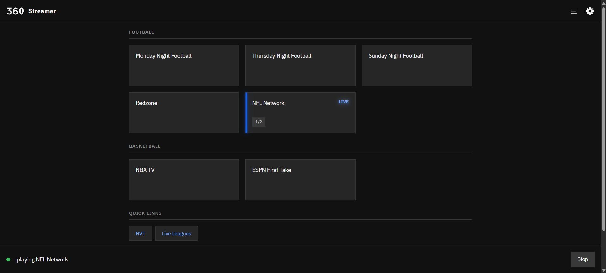

# HDMI Stream Player

Plays a football stream full-screen on a TV plugged into a Raspberry Pi's HDMI
port. One method, end to end: a kiosk **Firefox** with uBlock Origin, driven
over Marionette so the video starts and fullscreens with nobody there to click.



Each supported streaming site is a small class (`streamplayer/sites/`) that says
what its pages need. Right now those are **liveleagues.me** and **ntv.st**
— the latter only the part of its site that carries a player. `--list-sites`
prints exactly what each class takes.

The stream links themselves are not in this repo. `streams.json` is gitignored
and lives only on the Pi; `streams.example.json` shows its shape.

Point it at streams you're authorized to watch.

There are two ways in: **the web control panel** at `http://<your-pi>.local:5000`
— a button per stream, from the phone in your hand — and the command line below,
for a one-off URL. The installer prints the exact address when it finishes.

## What you need

- A **Raspberry Pi** with a TV or monitor on one of its HDMI ports. It was
  developed and measured on a Pi 5; a Pi 4 should work but has not been tried.
- **Raspberry Pi OS (Bookworm) with the desktop**, not Lite — the browser draws
  on the desktop session. It was built and tested on the **wayfire** desktop.
  Pi OS's newer default, **labwc**, is handled by the installer and the player
  (neither assumes wayfire), but has not been tested end to end yet.
- The Pi set to **log into the desktop automatically** (`sudo raspi-config` →
  System Options → Boot / Auto Login → Desktop Autologin), so there is something
  to play on after a reboot. The installer checks and says if it is not.
- A network connection, and a phone or computer on the same network for the panel.

## Install

On the Pi, one command does the lot — packages, kiosk profile, login, screen
settings, and the panel enabled at boot:

```bash
git clone <this repo> && cd <repo folder>
./install.sh
```

Nothing about any particular Pi or TV is built into the project. What the
install needs to know about yours, it finds out and asks as it goes:

| It asks | Why |
|---|---|
| a login for the panel's **Advanced** tab | playback defaults, maintenance and reboot sit behind it |
| **which HDMI port** is the TV — only if displays are on more than one | streams need to know which screen is theirs |
| whether to **play at 1920x1080** — only if the screen is bigger | the Pi cannot scale video to 4K smoothly; see [Screen resolution](#screen-resolution) |
| whether to **hide the mouse pointer** | a TV rarely has a mouse, but the desktop draws one anyway |
| whether to use the project's **desktop background** | it is your desktop |

The answers go into `config.json` (gitignored, kept on the Pi), never into the
code. Run from a script with no terminal, every question takes its default and
the login is left for later.

It is safe to re-run after a `git pull`; every step checks before it acts. See
[Autostart on boot](#autostart-on-boot) for what it sets up and how to do it by
hand.

```bash
./install.sh --reconfigure-auth     # change the Advanced-tab login
./install.sh --reconfigure-display  # re-answer the screen questions (new TV, other port)
./install.sh --help                 # the --no-* flags for skipping steps
```

## Quick start

```bash
# The control panel (running as a service once installed; see "Web control")
xdg-open http://<your-pi>.local:5000

# Play a match page on the TV
./stream.py '<match page URL>'

# What would run, without launching it
./stream.py --dry-run '<match page URL>'

# What's supported, and what the Pi can see of its screens
./stream.py --list-sites
./stream.py --list-displays
```

It works over SSH — no need to sit at the Pi. `Ctrl-C` shuts the browser down.

## What gets detected

None of these are configured by hand:

| Item | How |
|---|---|
| The TV's HDMI port | whichever port has a display on it, unless install saved a choice |
| The display session | the Wayland socket (or X display) the desktop actually created, at each launch |
| Screen resolution | switched to your saved choice before each stream, if you made one |
| Kiosk profile | `~/.config/stream-firefox`, with uBlock Origin sideloaded |

`./stream.py --list-displays` shows what it found. `--connector` and `--mode`
override the saved choices for one run.

## How it works

```
URL ──► sites.for_url()          which site class owns this domain?
        └─► site.launch()        kiosk Firefox command + profile prefs
            └─► supervisor       run it, restart it when it dies
                └─► site.drive() Marionette: find the video, click it, fullscreen
```

**The browser.** Firefox in `--kiosk` on its own profile (`--no-remote`, so a
restart is a fresh window rather than a tab handed to a Firefox you have open by
hand). It fullscreens natively under the desktop's Wayland compositor, and it takes the *full* uBlock
Origin — which is the reason it's the only player here: these pages are ad-heavy,
and a kiosk has no pointer to dismiss an overlay or close a popunder.

**Driving the page.** A stream page hands you a player, not a stream: the video
sits in a cross-origin iframe behind a poster you're meant to click, filling a box
in the middle of the page. So Firefox is launched with **Marionette**, its
built-in remote protocol (plain JSON over TCP, no extra packages), and the site
class finds the video in whichever frame owns it, clicks its poster the way a
person would, and asks for fullscreen. Some sites wrap that iframe in another
iframe, so the search walks down as many levels as the class asks for
(`frame_depth`; ntv.st needs two). It logs `liveleagues: playing fullscreen`
when that worked, says which half failed when it didn't, and never takes the
stream down with it — a page you can still click by hand is the worst case.

`--no-autoplay` turns that off and leaves the video to you.

**Staying up.** Live feeds drop. The supervisor rebuilds the launch (so a page
URL carrying an expired token is re-read) and restarts, with exponential backoff
up to 30s. A stream that played for over a minute before stopping resets the
backoff, so a normal blip reconnects quickly while a genuinely dead source backs
off instead of hot-looping. A browser that dies instantly and cleanly is reported
as a bad URL rather than retried forever.

- `--retries -1` (default) — keep trying forever
- `--retries 0` — one attempt, then exit
- `--retries 5` — at most 5 restarts

## Supported sites

```bash
./stream.py --list-sites
#   liveleagues    liveleagues.me
#   ntv            ntv.st (narrowed to the pages with a player)
```

A URL is matched on its hostname, subdomains included, and the scheme is optional
(`example.com/match/1` works). A class may narrow that further and claim only
part of a domain — `ntv` does, because most of its site carries no player to
drive — and what each one accepts is what `--list-sites` prints. An unmatched URL is an error rather than a guess, and a URL whose host is
claimed but whose page is not says so specifically. `--site ntv '<url>'` forces a
handler onto a page it doesn't claim, which is how you try a server it has never
seen.

### Adding a site

**Drop one file in `streamplayer/sites/` with a `StreamSite` subclass in it.**
That is the whole job — the package is scanned at import, so there is no list to
register in and nothing shared to edit. The base class
([`sites/base.py`](streamplayer/sites/base.py)) carries the whole launch, so a
site that needs nothing special is this much:

```python
# streamplayer/sites/liveleagues.py
from .base import StreamSite

class LiveLeagues(StreamSite):
    name = "liveleagues"
    domains = ("liveleagues.me",)

    def drive(self, page):
        self.play_fullscreen(page)
```

A module that fails to import is logged and skipped rather than taken as fatal,
so one broken site does not stop the TV playing everything else. Same for a class
that forgets `name` or `domains`. Check yours was picked up with
`./stream.py --list-sites`.

`drive()` is the one required piece: what to do once the page is up. It runs in a
thread beside the browser, may block as long as it likes, and is allowed to fail —
an exception is logged, not fatal. Everything else is an optional override:

| Hook | Default | Override it when |
|---|---|---|
| `domains` | — | always; the hostnames this class claims |
| `drive(page)` | — | always; how the video gets playing |
| `page_url()` | the URL as given | the site needs a rewrite (an embed path, a query flag) |
| `prefs()` | none | the profile needs a pref for this site only |
| `video_timeout` | 60s | the player takes longer to appear |
| `act_timeout` | 25s | it needs longer coaxing once it does |
| `play_timeout` | 60s | it buffers for a while before the picture arrives |
| `frame_depth` | 1 | the player sits inside a second iframe |
| `handles(url)` | any URL on `domains` | only part of the domain has a player |
| `accepts()` | the domains | `handles()` was narrowed and `--list-sites` should say so |

`play_fullscreen(page)` is the shared routine — poll, click the poster while
paused, request fullscreen, give up with a useful log line. A site with a server
chooser or a consent dialog does its own steps first (`page.click_text('button',
'Server 2')`) and then hands over to it. The full page API is in
[`marionette.py`](streamplayer/marionette.py).

## Contributing

Anyone with access may change **two things**, and nothing else:

| You may | Why |
|---|---|
| `streams.example.json` | the shape of the button file — keys, examples, comments |
| a **new** `streamplayer/sites/<yoursite>.py` | one file per streaming site |

Everything else — the web app, the player, the installer, and the two shared
files inside `sites/` — belongs to the owner.

`streamplayer/sites/base.py` and `streamplayer/sites/__init__.py` are **off
limits** even though they live in `sites/`. They are not sites: `base.py` is the
template you subclass, and `__init__.py` is the dispatch that discovers your file
on its own. Adding a site needs neither, which is exactly why discovery is
automatic — see [Adding a site](#adding-a-site).

`config.json` is **not** in the repo and cannot be. It holds the Advanced-tab
password in plain text, so it is gitignored and stays on each machine. Run
`./install.sh` and it builds you your own from `config.example.json`.

### How to contribute

You will have **Read** access, not Write, so there is nothing to push to. Fork
the repo, commit to a branch of your fork, and open a pull request.

A GitHub Actions check runs on every pull request and **fails it if the diff
touches anything outside the two paths above**, naming the offending files. The
check is the rule; the table is just where it is written down.

```bash
gh repo fork OWongit/free-streamer --clone
cd free-streamer
git switch -c add-sportsurge
$EDITOR streamplayer/sites/sportsurge.py
./stream.py --list-sites            # confirm it was discovered
./stream.py --dry-run 'https://sportsurge.net/some-match'
git add streamplayer/sites/sportsurge.py && git commit && gh pr create
```

## Web control

A Flask app serves a control panel on the LAN: one button per stream, a status
bar, and a Stop button. It runs as a user service already, so it is up after
every reboot — open it from a phone on the home wifi:

```
http://<your-pi>.local:5000      (or http://<its IP address>:5000)
```

`<your-pi>` is the Pi's hostname (`hostname` prints it); `hostname -I` gives the
address if `.local` names don't resolve on your network.

Tapping a stream stops whatever is playing and starts the new one, so switching
games is one tap. The bar shows `starting` until the player reports the video is
actually playing fullscreen — that takes ten seconds or so, because Firefox has
to boot, the page has to load, and the video has to be found and clicked. If a
stream misbehaves, the **Log** panel at the bottom carries the same output you
would have seen in the terminal.

There is no password: anyone on your wifi can put a stream on the TV. That is the
usual trade for a household remote. `serve.py --host 127.0.0.1` closes it down to
the Pi itself.

### Settings

**Settings → Streams** adds, edits, reorders and deletes buttons, writing
`streams.json` for you. No login: anyone who can play a stream can rearrange the
buttons. Saves are careful — the file is validated before it is touched, the
previous version is kept as `streams.json.bak`, and a save from a page that was
left open while the file changed on disk is refused rather than allowed to
clobber the newer version.

**Settings → Advanced** needs a login, and only exists once you configure one:

```bash
cp config.example.json config.json
nano config.json          # set auth.username and auth.password
```

Until then the tab shows how to set it up and every admin route answers 403.
`config.json` is gitignored, because the password is stored exactly as you type
it. This is plain HTTP on your wifi, so the password travels in the clear —
don't reuse one that matters. Five wrong attempts lock that device out for five
minutes.

Behind the login:

- **Playback defaults** — autoplay, retries, display backend, kiosk profile and
  extra Firefox args, applied to every button that doesn't set its own. Each
  stream can still override them in its own editor row.
- **Maintenance** — restart the web service, update uBlock Origin (runs
  `setup-firefox.sh`), kill a stray Firefox holding the kiosk profile, and a
  diagnostics pane with `--list-displays`, `--list-sites` and the service status.
- **Power** — reboot or shut down the Pi. Both make you type the action's name
  first.

### streams.json

The buttons come from `streams.json` — edited from the Streams tab, or by hand.
Either way the file is re-read on every request, so an edit over SSH shows up on
the next page load with no restart.

It is **gitignored**: real stream links stay on the Pi and never reach the repo.
A fresh clone has only [`streams.example.json`](streams.example.json), which
`install.sh` copies into place the first time and never overwrites after. Keep
links out of everything else too — the site classes in `streamplayer/sites/`
name the domains they handle, and that is the only place a site appears in code.

```json
{
  "streams": [
    {
      "id": "prem-main",
      "label": "Premier League — Main Event",
      "urls": [
        "https://example.com/some-match",
        "https://example.org/backup-page"
      ],
      "group": "Football",
      "note": "kick-off 15:00",
      "autoplay": true,
      "retries": -1,
      "site": null,
      "firefox_args": []
    }
  ]
}
```

| Key | Default | Meaning |
|---|---|---|
| `urls` | **one link required** | every page this button can play, in order |
| `url` | — | the one-link spelling of `urls`; use either |
| `label` | the first URL's host + path | the button's text |
| `id` | a slug of `label` | what the button posts to; must be unique |
| `group` | none | heading the button is filed under |
| `note` | none | small print on the button |
| `site` | matched from the URL | force a site class, like `--site` |
| `autoplay` | `true` | `false` leaves the video for you to click |
| `retries` | `-1` (forever) | restarts after a drop, like `--retries` |
| `firefox_args` | none | extra Firefox flags, like `--firefox-arg` |

**Several links on one button.** These sources die constantly, so a button can
hold more than one link to the same thing. The first tap plays the first link;
tapping the same button again moves to the next, wrapping round at the end — the
answer to "this feed is down" is another tap rather than an edit. The button
shows where it is (`2/3`), and the links may be on different sites, so a
liveleagues.me link and an ntv.st one can sit on the same button.

The position lives on the Pi, not in the browser, so every phone agrees on what
the next tap does. It goes back to the first link when a *different* stream is
started, and when the web service restarts. Stopping is not a reset: a stream
that just failed is the usual reason to reach for the next link. `site` and the
other settings belong to the whole button, so don't force one on a button whose
links span different sites.

**Quick links.** A separate top-level `links` key puts a row of chips between the
buttons and the Direct link box. These are not buttons: tapping one opens that
site **in a new tab on whatever phone or laptop is looking at the panel**, never
on the TV. The point is to browse a site's listings where you are standing, then
paste the link you want into Direct link to put it on the screen.

```json
{
  "links": [
    "https://example.com/",
    { "label": "Example", "url": "https://example.org/listings", "note": "what is on it" }
  ],
  "streams": [ ... ]
}
```

A bare string is the short form and labels itself from the address; an address
with no `https://` gets one. The object form takes a `label` and a `note` — the
note is a tooltip, so it shows on a computer and not on a phone, which is worth
knowing before writing anything important in one. Only `http` and `https` links
are rendered, and a link's problems appear in the warning banner on this page
only, never on the settings page. Keep `links` *above* `streams` in the file: a save
from the Streams tab rewrites only `streams` and leaves everything else exactly
where it is, so an entry written below it would be shuffled up on the first save.

Anything wrong with the file shows up *on the page* rather than breaking it: a
JSON syntax error becomes a red banner naming the line, and a bad entry (no URL,
a duplicate id, a misspelled key) becomes a warning while the rest still works. A
repeated link is dropped quietly. A button no site class claims *any* link for is
badged **unsupported** and asks for confirmation before it runs; one where only
some links are unclaimed says how many.

### Behind the buttons

Flask holds no playback logic — it runs `./stream.py` the same way you would, one
child at a time, and reads its log to know what to show. The player and the web
app therefore cannot disagree about how a stream is opened.

| Route | Auth | Does |
|---|---|---|
| `GET /` · `GET /settings` | — | the pages |
| `GET /api/streams` | — | the catalog as JSON, with the handler each URL resolves to |
| `GET /api/status` | — | state, current stream, and the log tail |
| `POST /api/play/<id>` · `POST /api/stop` | — | play and stop |
| `POST` · `PUT` · `DELETE /api/streams…` | — | add, edit, delete, reorder |
| `POST /api/login` · `/api/logout` | — | the Advanced session |
| `GET` · `PUT /api/admin/config` | admin | playback defaults (never the password) |
| `POST /api/admin/action/<name>` | admin | restart-web, update-ublock, kill-firefox, reboot, shutdown |
| `GET /api/admin/diagnostics` | admin | display, site and service output |

Writing routes require an `X-Requested-With: stream-panel` header, which a
cross-site form cannot send — cheap protection for a cookie session.

Handy from the command line too:

```bash
curl -sX POST localhost:5000/api/play/prem-main | python3 -m json.tool
curl -sX POST localhost:5000/api/stop
systemctl --user restart stream-web.service
journalctl --user -u stream-web.service -f
```

Only one stream can play at a time: the kiosk profile is locked to a single
Firefox, so the app waits for the old one to exit before starting the next. If
you leave a `./stream.py` running in a terminal and then tap a button, the page
tells you which process is holding the profile rather than failing obscurely.

## No mouse pointer

A Pi driving a TV rarely has a mouse, but the desktop draws a pointer anyway, and
it sits behind the stream for anyone to see between matches. Neither desktop Pi
OS ships can simply hide it — wayfire's `[input]` section offers `cursor_theme`,
`cursor_size` and two speeds, and that is all — so `./hide-cursor.sh` gives the
desktop a cursor theme whose every cursor is one transparent pixel:

```bash
./hide-cursor.sh        # install.sh offers this; --no-cursor skips the question
```

It writes `~/.local/share/icons/blank` (a valid Xcursor file per nominal size,
and every cursor name a browser might ask for symlinked to it, so no name falls
back to a real pointer), then points whichever desktops are installed at it:

- **wayfire** — `[input] cursor_theme = blank` in `~/.config/wayfire.ini`,
  leaving the rest of that section (your keyboard layout lives there) alone.
- **labwc** — `XCURSOR_THEME=blank` in `~/.config/labwc/environment`. If that
  file does not exist yet it is started as a copy of `/etc/xdg/labwc/environment`,
  because the system file carries settings the session needs, and a user file
  holding only the cursor line could stand in for it.

Both keep a `.bak`. It takes effect at the next login. It is desktop-wide, so a
mouse plugged in later still works but has nothing to look at: to undo it, set
the theme back to the one your system file names (`PiXflat` on Pi OS).

## Screen resolution

On a screen bigger than 1080p, the player can switch it to 1920x1080 before each
stream — the installer asks. Nothing played here is bigger than 1080p, and
upscaling it to 4K is the most expensive thing in the whole pipeline. Measured on
a Pi 5 with a 4K TV, same 1080p60 stream:

| Output | Decoded | On screen | Dropped |
|---|---|---|---|
| 3840x2160 | 59.9 fps | 20.6 fps | 65% |
| 1920x1080 | 59.9 fps | 59.1 fps | ~1% |

The decoder keeps up either way — software H.264, since the Pi 5 has no hardware
decoder for it (only HEVC), costs well under one of its four cores. What fails is
the GPU scaling and compositing four times the pixels sixty times a second. At
1080p the TV does that upscaling in its own hardware, for free, and loses no
detail from a source that was never above 1080p.

The choice is saved in `config.json` and applied by `stream.py` just before the
browser starts, through `wlr-randr` (or `xrandr` on an X desktop), so it works
under wayfire and labwc alike and survives reboots by simply being re-applied.
It picks the best refresh at or below 60Hz — a bare `1920x1080` can land on a
TV's 24Hz film mode — and does nothing when the screen is already there, since
every switch blanks the TV for a moment. It never switches under a playing video.

```bash
./install.sh --reconfigure-display     # change the answer
./stream.py --mode native '<url>'      # leave the screen alone for one run
./stream.py --mode 1280x720 '<url>'    # or pick another size for one run
```

**WebRTC is off in the kiosk profile, and that is a performance setting too.**
ntv.st's player runs a peer-to-peer engine that makes every viewer a seeder: the
Pi was measured uploading 2.5–7.7 Mbit/s of the stream to other viewers, over
the same wifi radio as the download, rising the longer it played. That cost about
ten points of CPU and made drops spiky. `media.peerconnection.enabled` is false in
`BASE_PREFS`, the engine falls back to plain HTTP, and the upload is gone.

## Ad blocking

`./setup-firefox.sh` sideloads uBlock Origin into `~/.config/stream-firefox` and
sets the kiosk prefs: autoplay allowed, notification prompts auto-denied, no
first-run tour, no fullscreen warning overlay. Re-run it any time to update
uBlock; nothing auto-updates a sideloaded add-on. It only ever touches the kiosk
profile, never the Firefox you browse with.

`STREAM_FIREFOX_PROFILE` (or `--profile`) points both the script and the player at
a different profile directory, which is how you test a change without disturbing
the kiosk on the TV.

**uBlock's toolbar icon is not reachable**, because `--kiosk` hides the toolbar.
To whitelist a page uBlock breaks, open it in an ordinary window first:

```bash
firefox --no-remote --profile ~/.config/stream-firefox '<url>'
```

What survives the blocker is the player's own pre-roll: it comes from the same
host as the stream, so blocking it would block the video too.

Firefox has no Widevine CDM on this board, so DRM services (NFL+ and the like)
will not play here at all. Check `about:support` under "Media Plugins" to confirm
that for a particular service.

## Checking it still works

```bash
./verify.sh                                  # kernel, display, profile, site handling
./verify.sh '<match page URL>'              # plus 45 seconds of real playback on the TV
```

## Autostart on boot

`./install.sh` does all of this. What follows is what it actually does, for
anyone debugging a half-installed box.

Both units are *user* services, because the streams they launch are Firefox
windows on the desktop session that owns the TV.

**They hang off `default.target`, not `graphical-session.target`** — this matters
and cost a debugging session. On the Pi it was built on, wayfire never activates
`graphical-session.target`: it sits `inactive` with the desktop fully up. A unit
`WantedBy` it therefore never starts at boot, and one that is `PartOf` it gets
killed the moment anything does cycle the target. `default.target` is reached
about five seconds into boot, and `rpi-connect.service` rides the same hook.

That also needs **lingering** (`loginctl enable-linger`), so the user manager
starts at boot instead of at first login. `install.sh` sets it.

Serving the page needs no desktop, but *playing* does, so the Pi should still log
in automatically: `sudo raspi-config` → System Options → Boot / Auto Login →
Desktop Autologin. `install.sh` warns if it cannot find it.

To check the wiring without rebooting:

```bash
systemctl --user show stream-web.service -p WantedBy   # want: default.target
loginctl show-user "$USER" --property=Linger           # want: yes
```

The repo ships the units as **templates** (`.in`), because a unit has to name an
absolute path and yours won't match the next person's. `install.sh` substitutes
`@REPO@` and `@UID@` when it renders them into `~/.config/systemd/user/`:

```bash
sed -e "s|@REPO@|$PWD|g" -e "s|@UID@|$(id -u)|g" \
    systemd/stream-web.service.in > ~/.config/systemd/user/stream-web.service
```

**[`stream-web.service.in`](systemd/stream-web.service.in) — the control panel.**
Installed and **enabled** by `install.sh`: the page is back after every reboot,
with nothing playing until you tap something.

```bash
systemctl --user status stream-web.service
systemctl --user restart stream-web.service      # after changing serve.py or webapp/
systemctl --user disable --now stream-web.service  # stop it coming back
```

Re-install it after editing the template — or just re-run `./install.sh`:

```bash
./install.sh --no-packages --no-firefox --no-wallpaper
```

**[`stream.service.in`](systemd/stream.service.in) — boot straight into one fixed
stream.** Provided but **not installed** by `install.sh`, and mostly superseded
by the panel: it hard-codes a single URL in its `ExecStart`. Use it only if you
want the Pi to come up playing one thing with no interaction. Don't run both —
they would fight over the kiosk profile.

```bash
mkdir -p ~/.config/systemd/user
sed -e "s|@REPO@|$PWD|g" -e "s|@UID@|$(id -u)|g" \
    systemd/stream.service.in > ~/.config/systemd/user/stream.service
nano ~/.config/systemd/user/stream.service   # replace STREAM_URL_HERE
systemctl --user daemon-reload
systemctl --user enable --now stream.service
```

## Troubleshooting

**The phone can't reach the panel.** Check the phone is on the home wifi (not
mobile data), then that the service is up: `systemctl --user status
stream-web.service`. If `<your-pi>.local` doesn't resolve, use the address —
`hostname -I` on the Pi prints it. The service only runs while the desktop session
does, since that session owns the TV.

**A button does nothing / the stream never starts.** Open the **Log** panel at the
bottom of the page: it carries the player's own output. `no site class handles …`
means the URL's domain has no class; `another Firefox … is using the kiosk
profile` means a `./stream.py` is still running in a terminal; `player exited
immediately` usually means the match link is dead or has expired.

**The page says `playing` but the TV shows the page, not the video.** The video
was found and started but fullscreen was refused — see the fullscreen entry
below.

**"no site class handles example.com".** That domain has no class yet. Either add
one (above) or force an existing handler with `--site liveleagues '<url>'`.

**"no desktop session found".** Firefox draws as a client of a compositor or an X
server; it cannot take over a bare console the way a KMS video player can. Start
the desktop (`sudo systemctl set-default graphical.target` and reboot) or run from
a machine state where `--list-displays` reports `wayland` or `x11`.

**The video plays but never goes fullscreen.** Fullscreen normally needs a real
click to borrow permission from. The pref that lifts that,
`full-screen-api.allow-trusted-requests-only`, is written into the profile before
every launch, so check the managed block at the end of
`~/.config/stream-firefox/user.js` survived — `setup-firefox.sh` rewrites that
file wholesale.

**Nothing is driven at all** (`nothing listening on marionette port ...`). Firefox
came up without `--marionette`, or another Firefox already holds the port.
Marionette's port is derived from the profile path rather than left at its default
2828, so two kiosks on different profiles don't collide; two players on the *same*
profile still would.

**The browser buries the terminal in log lines.** Firefox prints a lot of harmless
chatter — GTK cursor warnings, WebGL probes against the Pi's V3D driver. The
supervisor hides the known-benign patterns (`BROWSER_NOISE` in
[`firefox.py`](streamplayer/firefox.py)) and reports how many it hid; `-v` shows
everything raw.

The worst of it, `Unable to load left_ptr from the cursor theme` repeated per
mouse movement, is a broken theme rather than a browser fault: this desktop uses
the PiXflat cursor theme, whose `cursors/default` is a symlink to a `left_ptr` the
theme doesn't ship. Switch to a complete theme if you want cursors to work rather
than just be quiet:

```bash
gsettings set org.gnome.desktop.interface cursor-theme Adwaita
```

**No audio.** Firefox plays through the desktop's audio server, not a device this
program picks. Check the sink in the taskbar's volume applet, or:

```bash
wpctl status                  # which sink is default
wpctl set-default <ID>        # make the HDMI (vc4hdmi) sink the default
```

**Stuttering on 4K.** The Pi 5 decodes H.264 in software; a 4K H.264 stream is the
case that drops frames. Most stream pages serve 1080p or below, where it's
comfortable. Nothing here caps the resolution — the page picks it.

**Everything hangs, and the browser won't die even with SIGKILL.** The display
stack is wedged in the kernel and only a reboot clears it. This happened once
during development (on a Pi 5), right after 4K HEVC hardware-decode playback:

```
Unable to handle kernel NULL pointer dereference at virtual address 00000000000004d1
Internal error: Oops: 0000000096000005 [#1] PREEMPT SMP
  drm_atomic_helper_unprepare_planes+0x4c/0xd8 [drm_kms_helper]
  drm_mode_cursor_universal / drm_mode_cursor2_ioctl [drm]
```

That's a NULL dereference inside the vc4 DRM cursor-plane path — a kernel/driver
bug, not something this program can cause or avoid from userspace. Symptoms: any
new GPU client blocks forever in an uninterruptible kernel ioctl. Check for it
with `sudo dmesg | grep -iE 'Oops|Unable to handle'`, and reboot to recover.
`./verify.sh` checks for it first thing.

## Layout

```
stream.py                      CLI entry point
serve.py                       web control panel entry point
streams.json                   the buttons: stream links and their settings (gitignored)
streams.example.json           its shape, to copy from
config.json                    Advanced login + playback defaults (gitignored; see config.example.json)
install.sh                     one-shot setup: packages, profile, login, service, wallpaper, pointer
setup-firefox.sh               one-time kiosk profile + uBlock Origin install
hide-cursor.sh                 takes the mouse pointer off the TV
.github/CODEOWNERS             who owns what; see Contributing
.github/workflows/scope-check.yml  fails a PR that edits outside streams.example.json + sites/
verify.sh                      post-reboot health check
images/desktop_background.jpg  wallpaper install.sh sets
streamplayer/display.py        HDMI connector and display-backend detection
streamplayer/firefox.py        kiosk Firefox launch, profile prefs, page-driver plumbing
streamplayer/marionette.py     Firefox's remote protocol, and the page operations on it
streamplayer/sites/base.py     StreamSite - the template every site implements
streamplayer/sites/liveleagues.py   liveleagues.me
streamplayer/supervisor.py     restart/backoff loop, signal handling, logging
webapp/catalog.py              read, validate and write streams.json
webapp/config.py               read and write config.json
webapp/auth.py                 the Advanced tab's login
webapp/actions.py              what the Advanced tab can run: maintenance, diagnostics, power
webapp/manager.py              runs one stream.py at a time; state and log tail
webapp/unknown.py              links the direct-link bar refused, parked for later
webapp/views.py                routes
webapp/templates/, static/     the pages themselves (no CDN, no build step)
systemd/stream-web.service.in  control panel autostart (installed and enabled)
systemd/stream.service.in      boot straight into one fixed stream (not installed)
```

The player is standard library only, driving the `firefox` binary already
installed. The web app adds one dependency, Flask, which is already here from
apt (`python3-flask`) — no virtualenv, no pip install.
